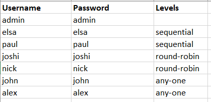

# vendor-workflow

Technologies Used: NodeJS, MongoDB, Handlebars

I have created a MVC model in NodeJS project. It contains the following files: 
1.	**Assests** – all the css and js is present in this folder
2.	**Connection**- This folder contains the connection code from mongodb
3.	**Controller** – This folder contains all the algorithms related to the project which is distributed in the different files
4.	**Model** – This folder contains the schema of the mongodb with three different mongodb collections
5.	**Routes** – This folder contains all the routes whose algorithms are present in the controller folder
6.	**Views** – This folder contains the templating of the website, which is coded in Handlebars

###### **Working of Project:**

There are total 7 users in the database (whose collection data has been attached in the database folder)
1.	User 1 – Admin: 

    a.	Amin can create a new request from the panel.
    b.	It can show the status of the requests, whether it has been approved, terminated or pending.
    c.	It can also view the logs created by the actions of the user.
2.	User 2 & 3 – Elsa and Paul:

    a.	These are the users at sequential level, where Elsa has to make action then Paul will be able to take any action.
3.	User 4 & 5 – Joshi & Nick:

    a.	These are the users at round robin level, where any one of the user can approve the request but it will go to level 3 only when all the users at this level has made an action over the workflow.
4.	User 6 & 7 – John & Alex:

    a.	These are the users at any-one level, any one of these can do action on the requests. If any one of the user did the action on the request, it will immediately go ahead.

All the user data has been shared, and a login system has been created, the password stored in the database is encrypted.

For Testing Reference: password is same as username.

